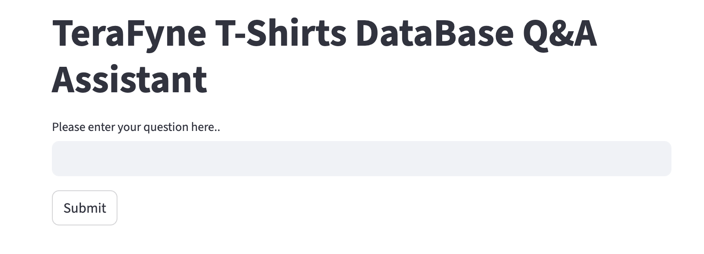
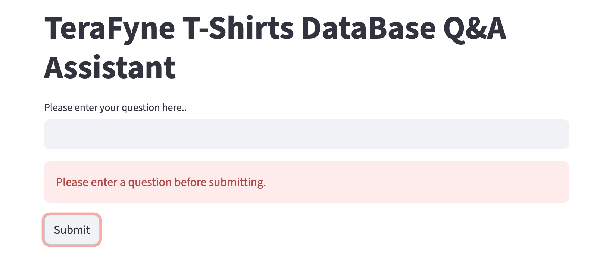
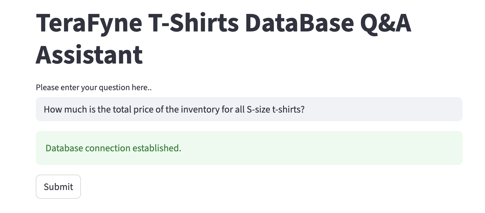
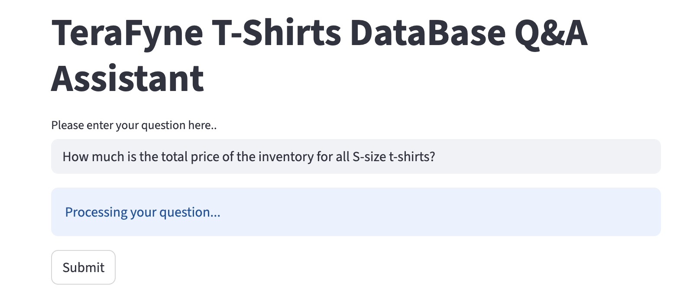
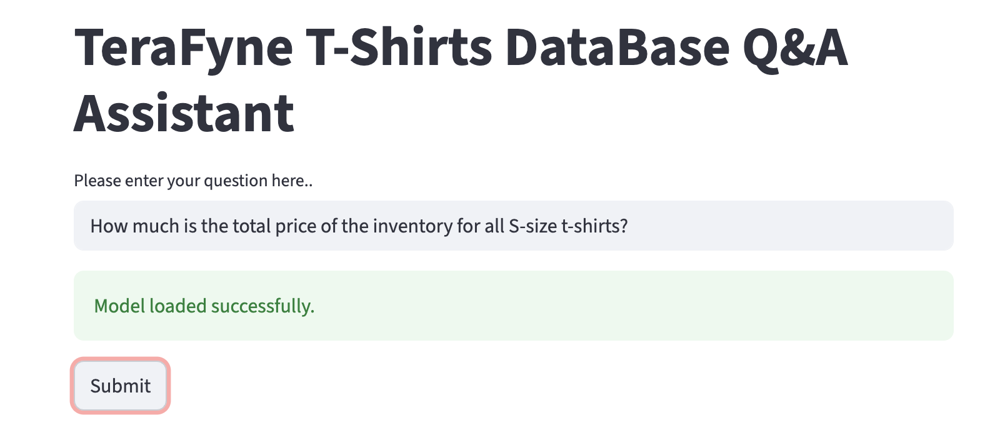
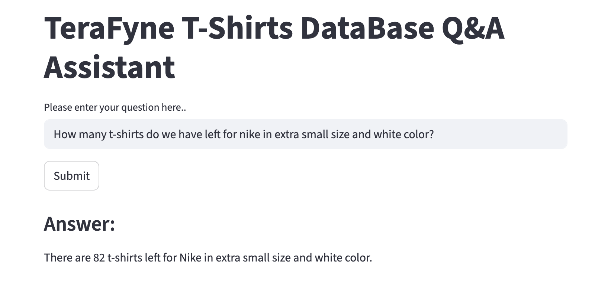

### 🛍️ Retail Domain Chatbot with LLM + SQL + Streamlit

This project is an **intelligent retail chatbot** that enables natural language interaction with a **SQL database** through **LLM-powered query generation**.

💡 **How it works:**

1. The user asks a question in natural language via the **Streamlit UI**.
2. The **LLM (Large Language Model)** converts the query into an appropriate **SQL query**.
3. The SQL query is executed on the **retail database**, and the results are displayed back to the user in an intuitive format.
4. When the LLM generates inaccurate queries or responses, **few-shot learning** examples are used to refine and improve its understanding.
5. A **Chroma DB vector store** is integrated to store embeddings and enable semantic search or context retrieval for more accurate query generation.

⚙️ **Tech Stack:**

* 🧠 **LLM:** For natural language to SQL query conversion
* 🗃️ **SQL Database:** Backend data source for retail information
* 🧩 **Chroma DB:** Vector store for semantic context retrieval and few-shot examples
* 💬 **Streamlit:** Interactive web-based user interface
* 🐍 **Python:** Core implementation language

🚀 **Features:**

* Query retail data using plain English
* Real-time LLM-to-SQL translation
* Few-shot learning to improve LLM accuracy
* Context-aware query generation using Chroma DB
* Simple and clean Streamlit interface

🧾 **Use Case Examples:**

* “Show me the total sales for the last quarter.”
* “List the top 5 best-selling products this month.”
* “Which stores had the highest revenue growth year over year?”

**Screenshots**

